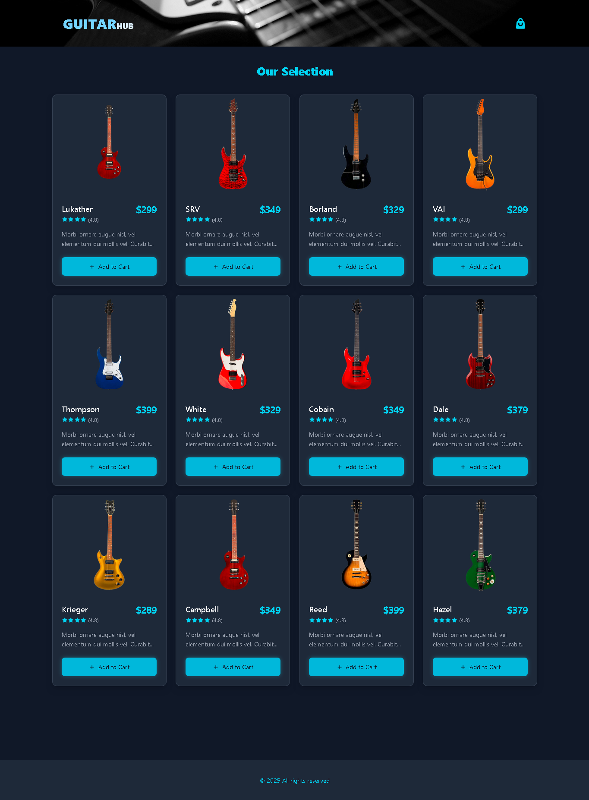

# ShoppingCart - React Practice Project 

 React-based project created to practice and demonstrate core React concepts. It showcases a simple e-commerce-like page where users can browse and manage their cart of guitar products. The project emphasizes React basics such as component structure, state management with useState, useReducer, and props.

---

## 🚀 Live Preview
Check out the live demo: [shoppingcart-component]()

## 📸 Screenshots

### Home View


---

## Features ✨

- **Product Listing**: Displays a collection of guitars with their names, prices, and descriptions.
- **Shopping Cart**:  
  - Add or remove items from the cart.  
  - Adjust the quantity of selected products.  
  - Calculate the total cost dynamically.  
- **Responsive Design**: The UI is styled to adapt to various screen sizes.  
- **React Concepts**:  
  - Use of components for modularity.  
  - State management with hooks (useState and UseReducer).  
  - Passing props for dynamic rendering.  
---

## Getting Started 🚀

### Prerequisites
Make sure you have the following installed:  
- Node.js  
- npm or yarn  

### Installation
1. Clone the repository:  
   ```bash
   git clone https://github.com/Diego3128/shoppingcart_react
   ```
2. Navigate to the project directory:  
   ```bash
   cd shoppingcart_react
   ```
3. Install dependencies:  
   ```bash
   npm install
   ```
4. Start the development server:  
   ```bash
   npm run dev
   ```
5. Open your browser and navigate to:  
   ```
   http://localhost:5173/
   ```

---

## Project Structure 🗂️
```
```

---

## Technologies Used 🛠️
- React
- heroicons  
- React Hooks (useState, useEffect, useReducer)  
- Tailwind for styling  
- Typescript
---


## License 📜
This project is open-source and free to use.  

---
